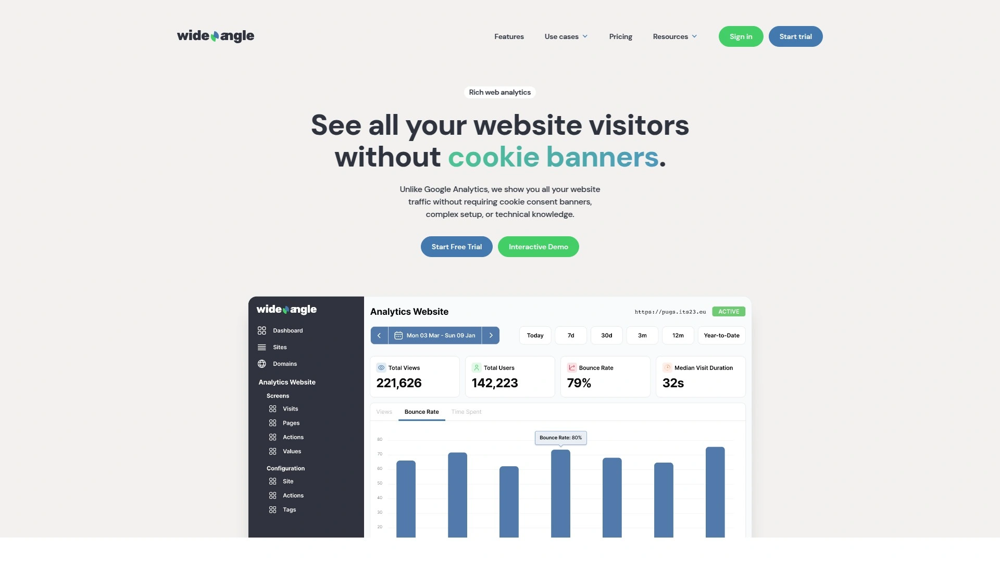
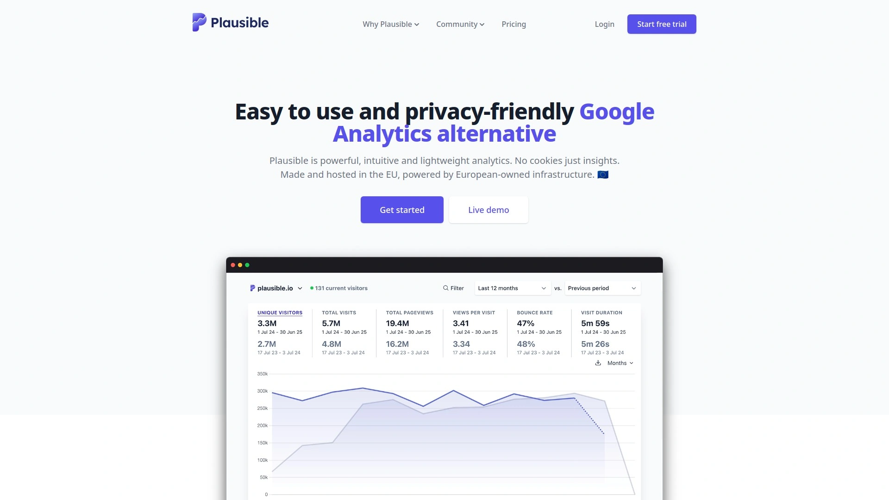
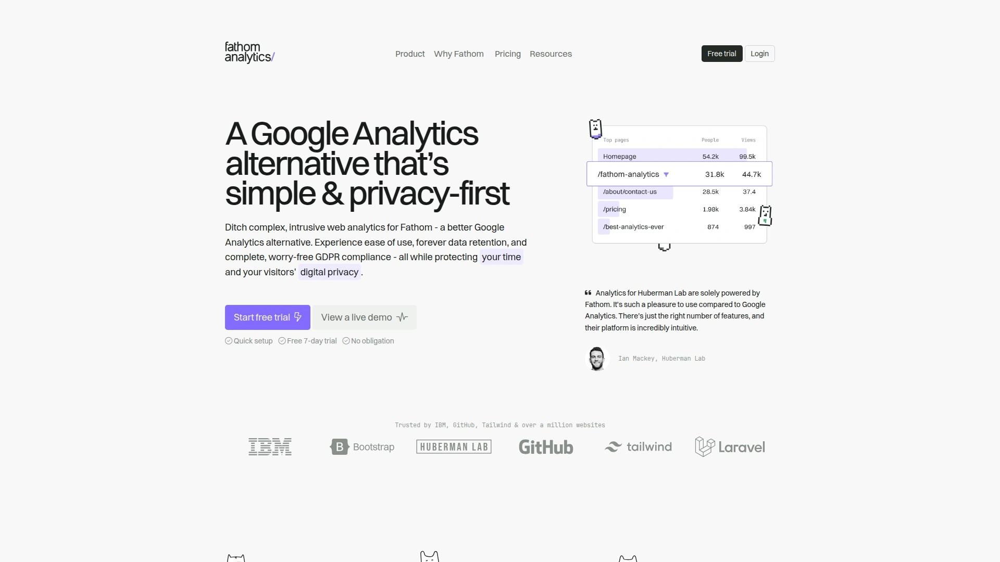
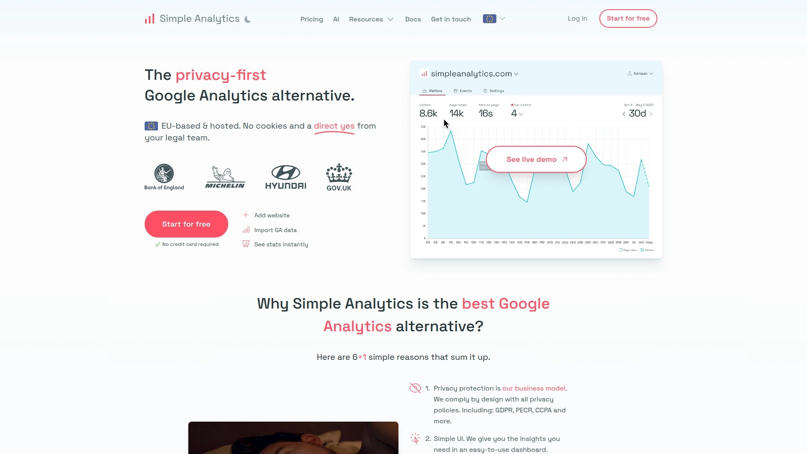
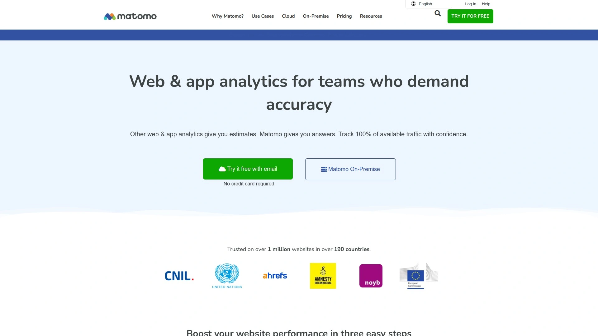
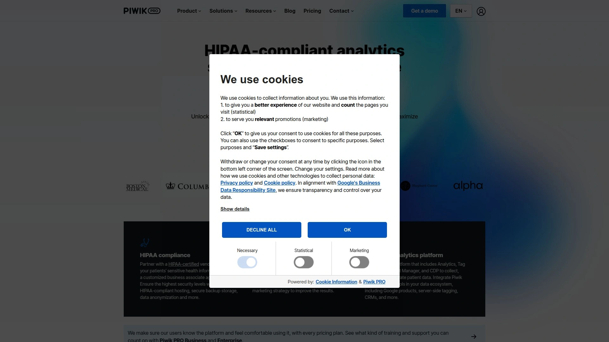
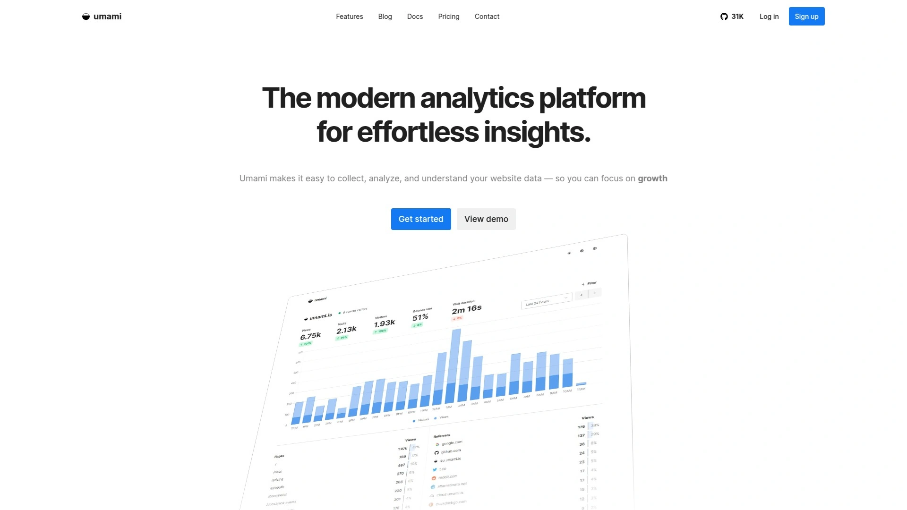
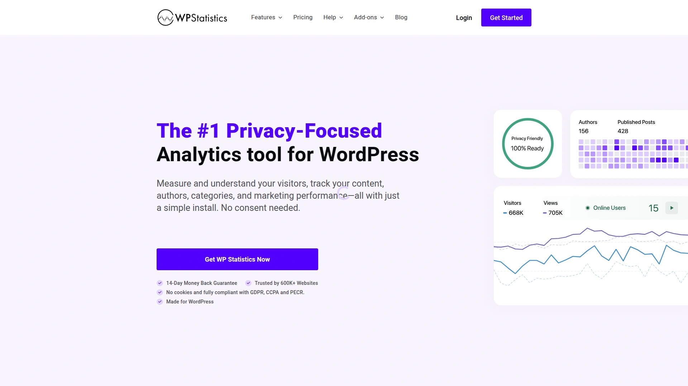
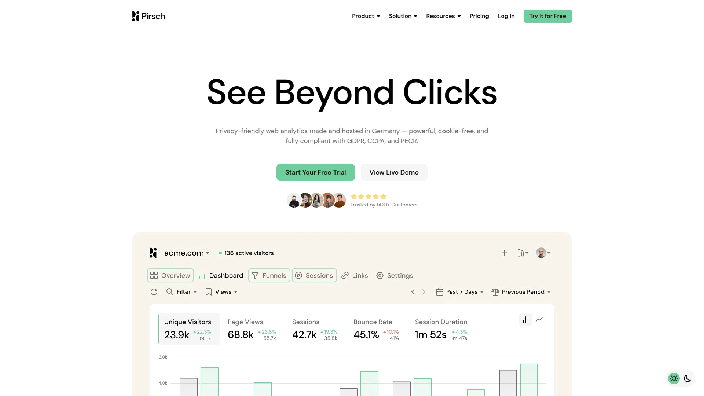

# No More Cookie Banners! Recommend 11 Privacy-Focused Game-Changers!

Ever watch your website traffic reports knowing you're missing 30-50% of visitors because they declined cookie consent or run ad-blockers? You're paying for Google Analytics while losing critical data, dealing with GDPR compliance anxiety, and frustrating users with intrusive consent banners before they even see your content. Traditional analytics platforms built their empires on surveillance capitalism—they track everything, share data with advertisers, and force you into legal gray areas where one wrong configuration triggers regulatory nightmares and fines reaching millions.

Privacy-focused analytics platforms eliminate these systematic problems by tracking website traffic without cookies, personal data collection, or consent requirements while maintaining full GDPR and CCPA compliance. You'll discover solutions ranging from simple dashboard tools starting at free tiers to comprehensive platforms with heatmaps and session recordings, capturing 100% of visitors including ad-blocker users while delivering faster page loads through lightweight scripts under 1KB.

## **[Wide Angle Analytics](https://wideangle.co)**

Complete visitor tracking without cookie banners delivering 100% traffic visibility effortlessly.

Wide Angle Analytics solves the fundamental flaw plaguing traditional analytics—between 29% and 50% of visitors remain invisible due to cookie consent rejection and ad-blockers creating massive blind spots in your data. The platform tracks 100% of website visitors without requiring intrusive cookie consent banners that frustrate users before they experience your content. This cookie-free approach means you finally see complete traffic pictures rather than partial samples missing the customers who care most about privacy.

The platform positions itself as remarkably simple compared to Google Analytics' overwhelming complexity designed for data scientists rather than marketers. Clean, focused dashboards show metrics that actually matter for marketing decisions without requiring SQL knowledge, coding skills, or technical training. Filter data with simple clicks, spot trends through visual charts updating in real time, and share ready-made reports with stakeholders in seconds rather than exporting spreadsheets and crafting presentations manually.

GDPR compliance comes built-in rather than bolted-on through complicated configurations requiring legal consultation. All data stays exclusively on European servers within German jurisdiction applying strict EU data protection laws. Automatic IP anonymization and zero personal data collection eliminate compliance anxiety—you're not walking regulatory tightropes hoping configurations satisfy evolving interpretations. No data sharing with third parties occurs under any circumstances, providing certainty impossible with platforms monetizing user data.

The ad-blocker resistance captures visitors using privacy tools who remain completely invisible to traditional analytics. This capability matters critically since privacy-conscious visitors often represent your most valuable customers—they research thoroughly, care about data protection, and make considered purchasing decisions. Team collaboration tools enable sharing custom reports with clients and team members using precise permission controls for each site. One-click connections exist for WordPress, Squarespace, Wix, Ghost, Webflow and other major platforms, with custom websites requiring under five minutes for setup. For marketers tired of Google Analytics complexity and data gaps, Wide Angle delivers complete visibility through approachable interfaces specifically designed for business decision-making rather than data science.

## **[Plausible Analytics](https://plausible.io)**

Lightweight open-source platform emphasizing simplicity and transparency at affordable pricing.

Plausible Analytics achieved popularity as lightweight alternative weighing under 1KB—45 times smaller than Google Analytics script—dramatically improving page load speeds while collecting analytics. This minimal footprint matters significantly for SEO since page speed directly impacts search rankings and user experience. The open-source nature enables community contributions, transparent development roadmaps, and self-hosting options for organizations requiring maximum data control.

The platform complies fully with GDPR, CCPA, and PECR without requiring cookie consent banners or complicated privacy configurations. No personal data gets collected or shared, providing peace of mind that analytics won't create regulatory exposure. The simple real-time dashboard displays essential metrics—visitors, pageviews, bounce rates, traffic sources—without overwhelming users with hundreds of data points requiring interpretation training.

Goal tracking and conversion measurement enable monitoring business outcomes rather than just vanity metrics. UTM parameter support tracks campaign performance, while shared dashboards facilitate team collaboration. The clean beginner-friendly interface makes Plausible accessible to marketers, founders, and small business owners lacking analytics expertise. However, advanced users note limited depth compared to enterprise platforms—no heatmaps, session recordings, or sophisticated funnel analysis.

Pricing starts at just $9 monthly for up to 10,000 pageviews, scaling affordably as traffic grows. All plans include unlimited websites making Plausible economical for agencies and multi-site operators. The transparent pricing without hidden fees or surprise charges appeals to budget-conscious teams. For startups, bloggers, and small businesses prioritizing simplicity and compliance over analytical depth, Plausible delivers essential insights efficiently.

## **[Fathom Analytics](https://usefathom.com)**

Premium privacy-first platform bypassing ad-blockers with enterprise infrastructure and reliability.

Fathom Analytics positions as premium offering emphasizing performance, reliability, and professional execution over budget pricing. The platform uses enterprise-level infrastructure ensuring consistent performance for high-traffic sites—critical for businesses depending on analytics for daily operational decisions. Over 200,000 websites trust Fathom instead of Google Analytics 4, demonstrating sustained market adoption beyond temporary trends.

The ability to bypass ad-blockers using custom domains represents significant differentiator—most privacy-focused tools still get blocked by aggressive privacy extensions. This bypass capability ensures truly complete data collection rather than losing privacy-conscious visitors. Email reports, real-time traffic data, and uptime monitoring provide operational visibility. The clean professional dashboard suits agencies presenting reports to clients without technical backgrounds.

Fathom doesn't collect or store IP addresses, using privacy-friendly methods creating temporary session identifiers expiring after one day that cannot trace back to individuals. This approach maintains GDPR compliance while providing accurate visitor counts and behavior data. The platform achieves full compliance with global privacy regulations including GDPR, CCPA, and PECR without requiring legal consultation or complex setup.

Pricing starts at $15 monthly for up to 100,000 pageviews, positioning above budget competitors but below enterprise platforms. All plans include coverage for 50 websites, unlimited data retention, and API access. The 30-day free trial provides extended evaluation period. Fathom suits established businesses and agencies prioritizing reliability and professional presentation over absolute lowest costs, particularly those dealing with clients requiring polished reporting.

## **[Simple Analytics](https://www.simpleanalytics.com)**

EU-based privacy champion collecting zero personal data with transparent straightforward pricing.

Simple Analytics lives up to its name by focusing exclusively on essential metrics without complexity or feature bloat. The Amsterdam-based company hosts all data within the EU, ensuring compliance with European privacy regulations. The platform collects literally zero personal data—no IP addresses, user agents, or identifying information—making GDPR compliance automatic rather than achieved through careful configuration.

The cookie-free approach means no consent banners disrupt user experience or create data gaps when visitors decline tracking. Fast loading times result from minimal script weight avoiding performance penalties characteristic of heavy analytics platforms. Clear visuals and automated reports make data accessible to non-technical team members. The platform supports tracking page views and events without tracing individuals, respecting privacy while delivering business insights.

Integration works with various tools and platforms through straightforward implementation. The 14-day free trial requires no credit card, removing barriers to testing. Pricing follows clear tiered structure—Starter at $10 monthly for 100,000 data points covering 10 websites, Business at $49 monthly for 1,000,000 data points across 100 websites, and Enterprise with custom pricing for higher volumes. The transparent pricing eliminates surprise charges or complex calculations based on features.

Simple Analytics targets businesses prioritizing privacy over comprehensive features—you get essential traffic data respecting visitor privacy without bells and whistles complicating analysis. The straightforward execution appeals to founders and small teams wanting insights without becoming analytics experts. For organizations valuing ethical data collection and EU compliance above feature completeness, Simple Analytics delivers principled tracking.

## **[Matomo](https://matomo.org)**

Comprehensive open-source platform offering self-hosting with enterprise features and heatmaps.

Matomo stands as most popular Google Analytics alternative used by over 1,000,000 websites worldwide including privacy-conscious organizations like the European Commission. The platform provides comparable feature depth to Google Analytics while offering self-hosting options ensuring complete data ownership and control. This self-hosting capability appeals critically to organizations with data residency requirements or compliance constraints preventing third-party data sharing.

The feature set extends beyond basic analytics into behavioral analysis including heatmaps, session recordings, A/B testing, and user flow visualization—all unified under single platform. This comprehensiveness eliminates need for multiple point solutions addressing different analytical needs. Custom alerts, tag managers, media analytics, and extensive reporting satisfy sophisticated users requiring enterprise capabilities. The Google Analytics importer enables migrating historical data when transitioning platforms, preserving analytical continuity.

Cookie-free tracking options exist though enabling this mode reduces data quality compared to cookie-based approaches. The platform offers both cloud hosting on European servers and self-hosting for maximum control. Integration ecosystem includes 100+ platforms spanning Google Ads, WordPress, Magento, and major CRMs. Advanced multi-channel reporting covers websites, mobile apps, and ecommerce operations.

Pricing complexity increases with feature additions—core open-source analytics is free to self-host, but advanced features like A/B testing and custom reports require annual add-on purchases. Managed cloud service charges by hits with 1 million hits costing approximately $170 monthly. The flexible but potentially confusing pricing suits organizations with specific feature needs willing to pay selectively rather than bundling everything. Matomo serves businesses requiring Google Analytics depth while maintaining privacy and data ownership control.

## **[PostHog](https://posthog.com)**

Developer-focused analytics combining web tracking with product analytics and experimentation tools.

PostHog differentiates by targeting engineers and product teams rather than pure marketers, combining web analytics with product analytics, session replays, A/B testing, feature flags, and user surveys. This comprehensive approach makes PostHog alternative not just to Matomo but also tools like Mixpanel, LaunchDarkly, and Heap. The platform particularly appeals to SaaS companies and product-led businesses requiring sophisticated product analytics beyond traffic monitoring.

The open-source foundation enables transparency, community contributions, and flexible deployment including self-hosting for data sovereignty. Product analytics features include custom trend analysis, funnels, user path visualization, retention analysis, and cohort segmentation. Direct SQL querying empowers power users extracting insights beyond standard reports. Session replays show exactly how users interact with products, including event timelines, console logs, and network activity.

A/B testing capabilities support up to nine test variations with automatic calculation of test duration, sample size, and statistical significance. This built-in experimentation removes dependency on separate testing platforms. The surveys functionality enables targeting by event or user properties with templates for NPS, PMF, and other standard questionnaires. Web analytics automatically captures pageviews, visitors, session duration, bounce rates, traffic sources, and referrers.

Pricing starts at free tier for basic usage, with paid plans beginning around $15 monthly scaling based on event volumes. The generous free tier enables extended testing before committing. PostHog suits technical teams building SaaS products requiring comprehensive analytics, experimentation, and product insights unified in single platform. The developer-centric approach means less hand-holding for non-technical users compared to marketer-focused alternatives.

## **[Piwik PRO](https://piwik.pro)**

Enterprise analytics suite emphasizing regulatory compliance with advanced privacy controls.

Piwik PRO spun out of Matomo in 2013 targeting enterprise customers requiring sophisticated privacy controls and regulatory compliance. The platform suits heavily regulated industries like healthcare, finance, and government where data protection isn't optional but legally mandated. Advanced privacy features include comprehensive consent management, granular data access controls, and extensive anonymization options beyond basic IP masking.

The analytics capabilities rival enterprise platforms with funnel analysis showing historical data retroactively, user flow reporting with customizable path analysis, and advanced segmentation. Funnels in Piwik PRO work flexibly without requiring goal setup and allow defining each step at granular levels. The built-in tag manager enables deploying tracking tags without developer involvement, while ensuring all tags respect privacy standards.

Data visualization options include flat tables, explorer views, bar charts, line charts, user flows, and funnels providing diverse analytical perspectives. Multi-channel reporting spans web, mobile, and product analytics. The platform integrates with Google services, major CRMs, and marketing platforms. On-premise and cloud deployment options accommodate different infrastructure requirements and compliance needs.

Pricing follows enterprise models with custom quotes based on requirements rather than published list prices. The premium positioning reflects sophisticated feature sets and compliance capabilities justifying investment for organizations where regulatory penalties or data breaches carry catastrophic consequences. Piwik PRO serves mid-market and enterprise customers in regulated industries requiring analytics depth matching Google Analytics while maintaining strict data protection impossible with advertising-funded platforms.

## **[Umami](https://umami.is)**

Open-source self-hosted platform offering simplicity and complete data ownership for free.

Umami delivers straightforward analytics through completely free open-source platform emphasizing simplicity and data ownership. The self-hosting requirement means running Umami on your infrastructure rather than relying on third-party services. This approach provides ultimate control over data location, retention, and access while eliminating monthly subscription costs. The GitHub community of 31,222 stars demonstrates active development and adoption.

The platform offers clean interface focusing on essential metrics without overwhelming complexity. Data retention spans 6 months to 5 years depending on configuration. Multiple website support enables managing various properties from single dashboard. The GDPR-compatible design requires no cookie consent banners. Developer API enables custom integrations and data exports.

Feature set remains intentionally focused rather than expansive—basic traffic analytics, event tracking, and referrer analysis without advanced capabilities like heatmaps, session recordings, or sophisticated funnels. This minimalism appeals to developers and technical teams wanting straightforward analytics without feature creep. Setup requires technical competency deploying and maintaining server infrastructure.

Umami suits developers, bootstrapped startups, and technical founders comfortable with self-hosting who prioritize data ownership and zero ongoing costs over managed convenience. The active open-source community provides support, though lacking formal customer service of commercial platforms. For technically capable teams wanting privacy-respecting analytics without subscriptions, Umami delivers solid fundamentals through self-hosted deployment.

## **[Swetrix](https://swetrix.com)**

Real-time cookieless analytics platform with built-in error monitoring and uptime tracking.

Swetrix positions as privacy-first fully cookieless analytics using first-party data and server-side processing. The live dashboard displays real-time visitor counts and goal completions without compromising privacy. Automatic IP anonymization and elimination of cookie consent banner requirements streamline compliance. The platform supports basic funnels and cohort analysis though features remain more limited than enterprise suites.

The differentiation comes through additional monitoring capabilities beyond pure analytics—error tracking, uptime monitoring, and alerting create unified observability platform. This combination appeals to developers and operations teams wanting consolidated tooling rather than separate analytics and monitoring systems. The technical stack built on Clickhouse instead of PostgreSQL enables fast data processing with near real-time insights.

Swetrix offers customizable dashboards and API access for event tracking and data exports. The lightweight tracking script avoids slowing website performance. However, native integrations remain limited beyond basic platforms like Google Tag Manager. Advanced features like funnels and cohort analysis are basic compared to sophisticated analytics platforms focused purely on behavioral analysis.

Pricing starts affordably at €5 monthly for up to 10,000 visits, scaling to €150 monthly for 10,000,000 visits. The 14-day free trial enables testing before commitment. Swetrix suits developers and technical teams wanting cookieless analytics combined with operational monitoring rather than purely marketing-focused traffic analysis. The enterprise features and Clickhouse infrastructure target larger organizations despite accessible entry pricing.

## **[WP Statistics](https://wp-statistics.com)**

WordPress-native analytics plugin delivering insights directly within admin dashboard.

WP Statistics serves WordPress users wanting analytics integrated directly into admin dashboards rather than separate platforms. The plugin stores data locally in WordPress databases providing complete ownership and eliminating external dependencies. This self-contained approach appeals to site owners valuing simplicity and avoiding monthly subscriptions for basic traffic insights.

The platform delivers essential metrics including visitors, pageviews, referrers, popular content, and geographic data. Real-time reporting shows current site activity. The WordPress-native integration means no external accounts, logins, or additional platforms cluttering workflows. Setup requires simple plugin installation and activation rather than adding tracking scripts or configuring external services.

Privacy focus includes automatic data anonymization and GDPR compliance without requiring cookie consent banners. The limitation lies in WordPress-specific scope—the solution only works for WordPress sites rather than providing platform-agnostic analytics. Feature depth remains more basic than dedicated analytics platforms, lacking advanced capabilities like funnel analysis, heatmaps, or sophisticated user segmentation.

WP Statistics suits WordPress site owners wanting straightforward traffic insights without leaving familiar admin interfaces or paying for external platforms. The free core plugin provides essential analytics, with premium add-ons available for enhanced features. For WordPress-focused users prioritizing simplicity and zero ongoing costs over comprehensive analytical depth, WP Statistics delivers practical integrated solution.

## **[Pirsch Analytics](https://pirsch.io)**

Privacy-friendly analytics with automatic bot filtering and developer-focused implementation.

Pirsch Analytics provides privacy-respecting analytics through lightweight tracking emphasizing simplicity and GDPR compliance. The platform automatically filters bot traffic ensuring data accuracy by excluding automated crawlers and scrapers that inflate traffic numbers. This bot filtering matters significantly since bot traffic can represent 20-40% of web traffic distorting actual human visitor metrics.

Developer-friendly implementation includes straightforward API integration and clear documentation. The platform supports multiple websites from single account. Privacy compliance comes standard without requiring complex configuration—no cookies, no personal data collection, and automatic IP anonymization. The clean interface focuses on essential metrics without overwhelming users with hundreds of data points.

Email updates provide regular traffic summaries delivered directly to inboxes rather than requiring daily dashboard checking. Public dashboard options enable sharing statistics transparently. Developer API enables custom integrations and data exports for teams building internal reporting tools. Data retention policies provide long-term historical data for trend analysis.

Pricing starts at $6 monthly positioning competitively against alternatives while including multiple websites. The combination of bot filtering, developer focus, and affordable pricing appeals to technical founders and development teams building web properties. Pirsch suits users wanting reliable traffic data with automatic bot exclusion and straightforward implementation over feature-rich platforms requiring significant onboarding.

## **[Twipla](https://www.twipla.com)**

Website intelligence platform using digital fingerprinting for cookieless visitor tracking.

Twipla employs cookieless tracking through digital fingerprinting technology creating unique visitor identifiers without storing data in browsers. The platform provides comprehensive website intelligence including traffic structure, KPIs, page performance, visitor insights, geolocation data, operating systems, devices, competition analysis, and campaign performance. This breadth positions Twipla as unified intelligence platform beyond basic traffic counting.

Key features include heatmaps showing where visitors click and scroll, conversion funnels identifying drop-off points in user journeys, custom event tracking for specific interactions, and session recordings replaying actual user sessions. These behavioral analytics capabilities provide qualitative insights complementing quantitative metrics. Privacy compliance comes built-in with data handled securely per legal regulations including GDPR.

The low-volume free plan enables testing core functionality before committing to paid tiers. Pricing scales from $10.39 monthly for 10,000 visits through $123.20 monthly for 200,000 visits. Higher traffic volumes require custom quotes. All plans include behavioral analytics features differentiating Twipla from pure traffic counting platforms.

Twipla suits marketers and product teams wanting behavioral insights—heatmaps, recordings, funnels—alongside standard analytics. The fingerprinting approach enables visitor recognition across sessions without cookies. For organizations requiring both quantitative traffic data and qualitative behavioral analysis through cookieless methods, Twipla combines capabilities typically requiring multiple platforms.

## FAQ

**Do privacy-focused analytics tools really capture 100% of visitors including ad-blocker users?**

Most cookie-free analytics platforms like Wide Angle Analytics, Fathom, and Plausible track significantly more visitors than Google Analytics by avoiding cookie requirements that trigger consent rejections, though aggressive ad-blockers still block some privacy tools. Fathom specifically offers custom domain routing that bypasses most ad-blockers, while others like Matomo and PostHog provide self-hosting options where you control the tracking domain making blocking harder. The "100% tracking" claim reflects comparison to traditional analytics missing 30-50% of visitors through consent rejection and standard ad-blocking, not literal immunity to all blocking technologies. The practical result: privacy-focused tools capture dramatically more complete data than Google Analytics while respecting user privacy through cookieless methods.

**Will switching to privacy-focused analytics affect my SEO or website performance?**

Privacy-focused analytics dramatically improve website performance through lightweight scripts—Plausible weighs under 1KB compared to Google Analytics at 45KB+, reducing page load times that directly impact SEO rankings and user experience. Simple Analytics, Fathom, and similar platforms load faster than Google Analytics, improving Core Web Vitals metrics Google uses for search ranking. Removing cookie consent banners creates cleaner user experience reducing bounce rates from frustrated visitors confronted with popups before content loads. The SEO impact is neutral to positive—you maintain traffic tracking for optimization while improving site speed and user experience metrics that influence rankings.

**How do I choose between self-hosted platforms like Matomo/Umami versus cloud-hosted services?**

Choose self-hosted platforms like Matomo, PostHog, or Umami when you need absolute data control for regulatory compliance, have technical resources managing infrastructure, or want avoiding monthly subscriptions. Self-hosting provides maximum privacy and customization but requires server maintenance, backups, updates, and technical expertise. Cloud-hosted services like Plausible, Fathom, Simple Analytics, and Wide Angle Analytics deliver instant setup, automatic updates, reliability guarantees, and customer support at monthly subscription costs. Cloud hosting suits non-technical teams, those prioritizing convenience over absolute control, and businesses wanting predictable costs without infrastructure management. Self-hosting makes sense for developers, enterprises with compliance requirements, and cost-conscious teams with technical capabilities; cloud hosting serves everyone else prioritizing simplicity and reliability.

## Conclusion

The privacy-focused analytics landscape offers solutions for every need from simple traffic counting to comprehensive product analytics, with deployment options spanning self-hosted infrastructure to managed cloud services and pricing from completely free to enterprise custom quotes. Your choice depends on whether you prioritize lowest cost, technical control through self-hosting, behavioral analysis depth, or managed simplicity alongside fundamental privacy compliance and complete visitor tracking. [Wide Angle Analytics](https://wideangle.co) excels for marketers wanting complete traffic visibility without technical complexity—the cookie-free tracking capturing 100% of visitors including ad-blocker users, elimination of consent banner friction, GDPR compliance built-in through EU servers and automatic anonymization, and simple dashboards designed specifically for marketing decisions rather than data science deliver exactly what matters. The platform's focus on removing blind spots caused by cookie rejection and ad-blockers while maintaining approachable interfaces makes it ideal for businesses tired of missing 30-50% of website visitors and wrestling with Google Analytics complexity designed for technical specialists rather than teams making business decisions from traffic data.
